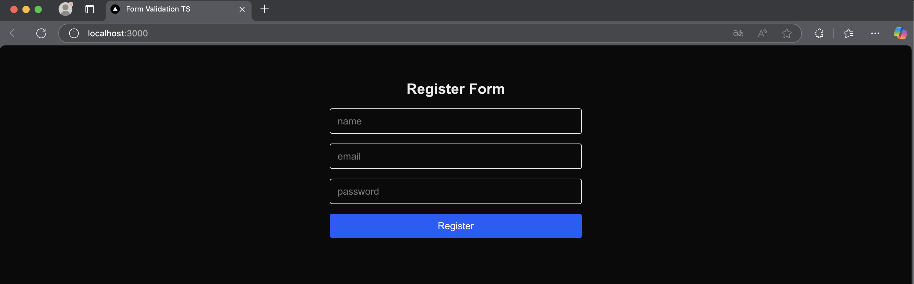
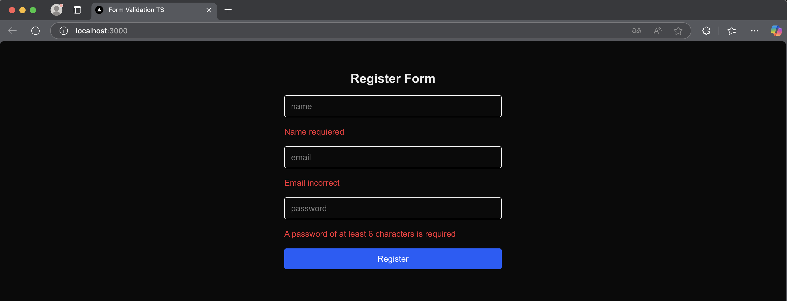

# 🧾 Registration Form

A simple and responsive registration form built with **Next.js 15**, **React**, **TypeScript**, and **Tailwind CSS 4**. Includes real-time validations, error handling, and accessibility best practices.

---

## 🚀 Technologies

- [Next.js 15 (App Router)](https://nextjs.org/docs)
- [React 19](https://react.dev/)
- [TypeScript](https://www.typescriptlang.org/)
- [Tailwind CSS 4](https://tailwindcss.com/)

---

## ✨ Features

- ✅ Input fields for name, email, and password  
- ⚠️ Real-time input validation  
- 📛 Error messages for each field  
- 🔒 Password strength check  
- 🧠 Built without external libraries like Formik or Yup  
- ♿ Accessible and responsive design with Tailwind CSS  
- 📦 Type-safe with TypeScript  

---

## 📸 Screenshots




---

## 💻 Installation

```bash
# Clone the repository
git clone https://github.com/Hewerth-dev/form-validation-app.git
cd form-validation-app

# Install dependencies
npm install

# Run the project
npm run dev
```

---

## 📬 Contact

Created by **Hewerth Altamirano**  
📧 hewerth.dev@gmail.com  